<!-- ✨ Animated Banner ✨ -->

 

<table align="center" border="0">
<tr>
<td width="38%" align="center" valign="middle">
<!-- 🪪 Swinging Lanyard ID Card (React Bits style, pure SVG) -->

</td>
<td width="62%" valign="middle">

### 🚀 Featured Projects

| Project | Tech | 
|:---|:---:|
| [🎓 Google Classroom Clone](https://github.com/aimanshahid800/google-classroom-clone-2) | `PHP` `MySQL` `CSS` | 
| [🤖 Nyra Chatbot](https://github.com/aimanshahid800/Nyra-AI-Chatbot) | `FastAPI` `Qdrant` `RAG` | 
| [🎯 Mood-Sync](https://github.com/aimanshahid800) | `Python` `FastAPI` `React` `Supabase` | 

 

> 💗 *"Turning ideas into agentic reality."*

</td>
</tr>
</table>

 

### 📊 GitHub Stats & Graphs

  

  

<!-- 📈 Contribution Activity Graph -->

  

<!-- 🏆 Trophies (local animated SVG — always loads) -->

  

### 🐍 Watch the snake eat my contributions

  

### 📫 Let's Connect

  

  

*⭐️ Always learning, always building.* 💗

